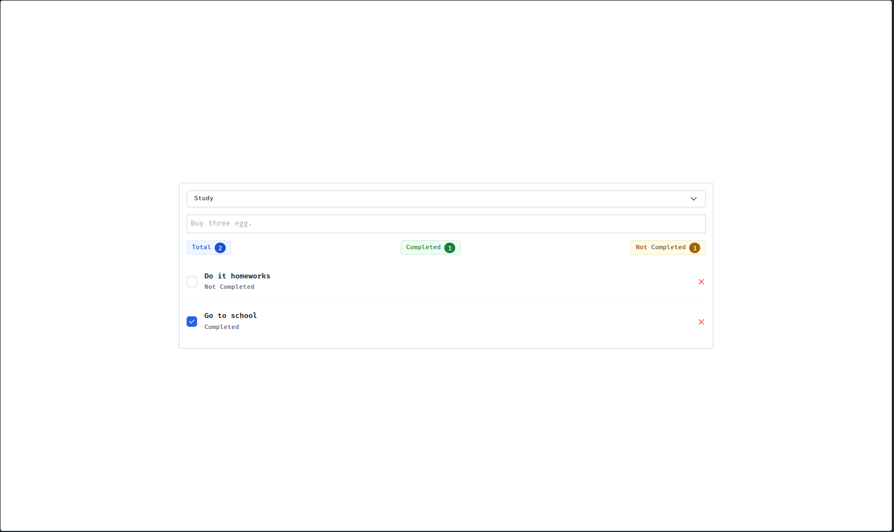
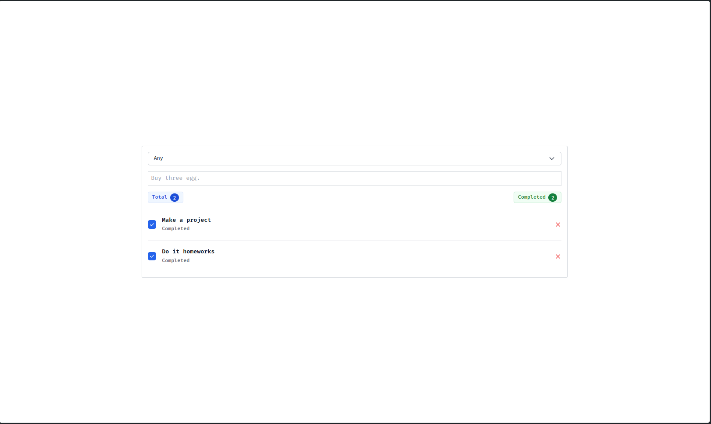
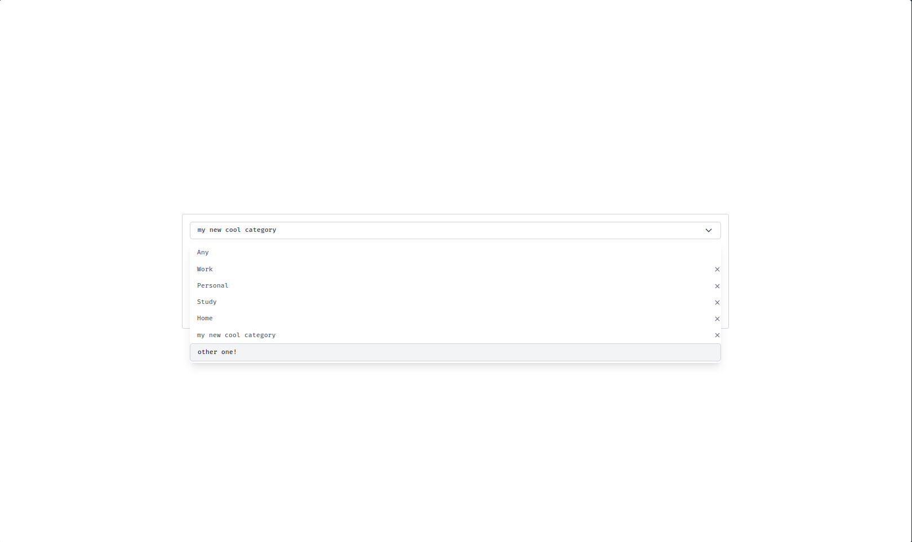
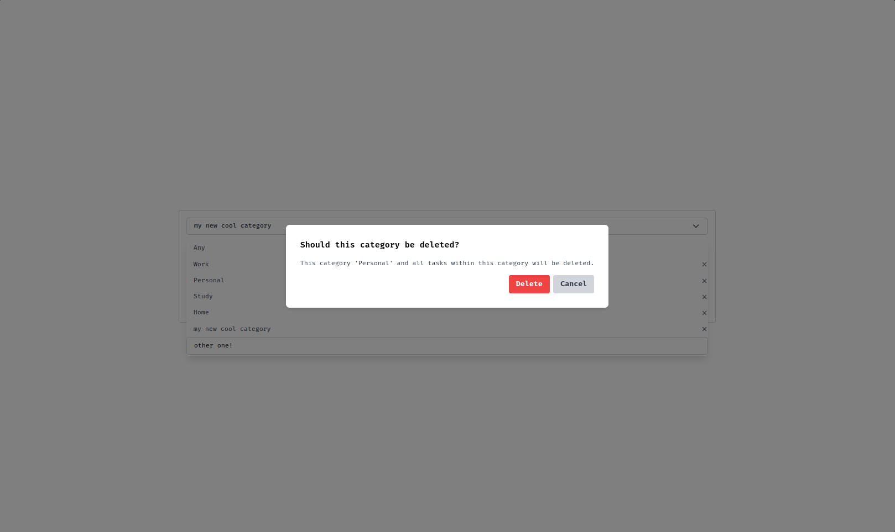

## To-Do App
- Simple to-do app

### Technologies
- [Vue](https://vuejs.org)
- [TailwindCSS](https://tailwindcss.com)
- [Vite](https://vitejs.dev)

### Run
```bash
# Install dependencies
npm i

# Preview (localhost only)
vite preview

# Preview (localhost & local network)
vite preview --host

# Build (serve recommended for run)
vue-tsc && vite build
serve dist
```

### Screenshots

#### Modern UI



#### Categories

